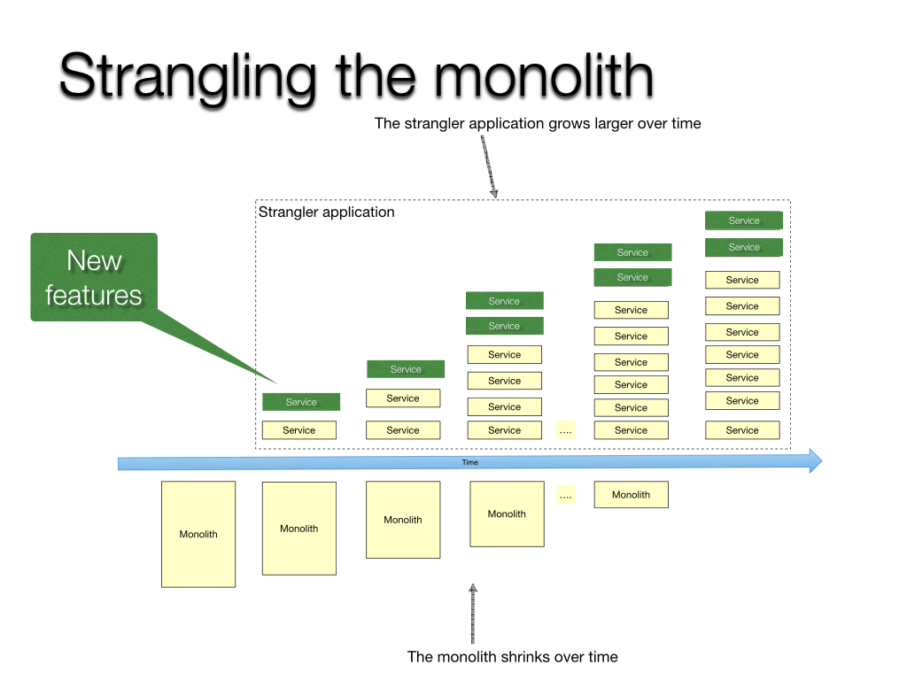

# Microservices Design Patterns Part 2

🚀 [Strangler Pattern](#strangler-pattern)  
🚀 [Saga Pattern](#saga-pattern)  
🚀 [CQRS Pattern](#command-query-responsibility-segregation-cqrs)

## Strangler Pattern
- `Strangler Pattern` is an architectural approach during the migration of a monolithic application to a microservice-based architecture.
- This pattern involves replacing parts of a monolithic application with microservices over time.
- This pattern is particularly suitable for legacy systems with complex codebases that are challenging to refactor entirely.
- In order to implement strangler pattern, we need to follow 3 steps: 
    ⏭ _Transform_ 
    ⏭ _Co-exist_ 
    ⏭ _Eliminate_  

    

    ### Advantages of Strangler Pattern

    😠**_Incremental Migration:_** 
        This pattern mitigates risks associated with complete system rewrites and minimizes disruptions by allowing a gradual migration process. 

    😠**_Flexibility:_** 
        Organizations can independently refactor and update specific parts of the system based on business priorities. 

    😠**_CoExistence:_** 
        The monolithic application and microservices coexist harmoniously, ensuring the system remains operational during the migration.

    ### Disadvantages of Strangler Pattern

    🤢 **_Complexity:_** 
        This migration process can introduce complexity due to the coexistence and interaction between monolith and microservices application.  

    🤢 **_Increased Network Calls:_** 
        The introduction of microservices can lead to an increase in network calls, potentially impacting system performance and latency.

## Saga Pattern
- Implementing `database per service` has a drawback to maintain consistent business transactions that span multiple services.
- Therefore `Saga Pattern` is a way to manage the data consistency(maintain ACID properties) across microservices in distributed transaction. 
- A saga is a sequence of local transactions that updates each services and **_publishes a message or event_** to trigger the next transaction step. 
- If a step fail, the saga executes the compensating transactions that reverse the previous transactions.  

    

- There are two ways of coordination sagas: 

    ✈ **_Choreography:_**  
        Each local transaction publishes domain events that trigger local transactions in other services. 

    ✈ **_Orchestration:_**   
        An orchestrator (object) tells the participants services what local transactions to execute.

    ### Advantages of Saga Pattern
 
    😠**_Maintain Data Consistency:_**  
        It enables the application to maintain data consistency across multiple services without using distributed transactions.

    ### Disadvantages of Saga Pattern

    🤢 **_Lack of automatic transaction rollback:_**  
        A developer must design compensating transactions that explicitly undo changes (in case of failure) made earlier rather than relying on automating rollback feature of ACID transactions. 
    
    🤢 **_Lack of Isolation:_**  
        The lack of isolation means that there’s risk that the concurrent execution of multiple sagas and transactions can use data anomalies.

## Command Query Responsibility Segregation (CQRS)
- **Context:**   
    When implement _Microservices architecture pattern_ and the _Database per service_ pattern. As a result, it is no longer straightforward to implement queries that join data from multiple services.
- **Problem:**  
    How to implement a query that retrieves data from multiple services in a microservice architecture?
- **Solution:**  
    Define a view database, which is a read-only replica that is designed to support that query. The application keeps the replica up-to-date by subscribing to Domain events published by the services that own data.   

    

    ### How to Sync database with CQRS design pattern? 

    Synchronizing databases in a system that follows the CQRS (Command Query Responsibility Segregation) pattern can be challenging due to the separation of the write and read sides of the application.
    But we can ensures it using the following:

    #### Event Sourcing
    - Event Sourcing involves capturing all changes of application state as a sequence of events. These events are stored in an event store and can be replayed to rebuild the state of the application at any point in time.

    - In a CQRS architecture, the write model generates events when commands are processed, and the read model subscribes to these events to update its state.

    - **_Benefits:_**  
        - Event sourcing provides a complete audit trail of all changes to the application’s state, which can be useful for debugging and compliance purposes. 

        - It also enables scalability and fault tolerance, as events can be replayed to rebuild the state in case of failure.

    - **_Challenges:_**  
        - Event sourcing introduces complexity, as developers need to design the events and event handlers carefully to ensure consistency and correctness. 

        - It also requires additional infrastructure for storing and replaying events.
    
    #### Messaging Systems
    - Messaging Systems such as Kafka, or RabbitMQ can be used to decouple the synchronization process between the write and read sides of application. 

    - The write model publishes events to a message queue, and the read model consumes these events to update its state.

    - **_Benefits:_**  
        - Messaging Systems provide a flexible and scalable way to synchronize databases, as they can handle large volumne of events and distribute them across multiple consumers.

        - They also enable asynchronous communication, which can improve overall system performance. 

    - **_Challenges:_**  
        - Implementing messaging systems can introduce complexity, as developers need to ensure that messages are processed in the correct order and that data consistency is maintained. 

        - It also requires additional infrastructure for managing and monitoring the message queues.